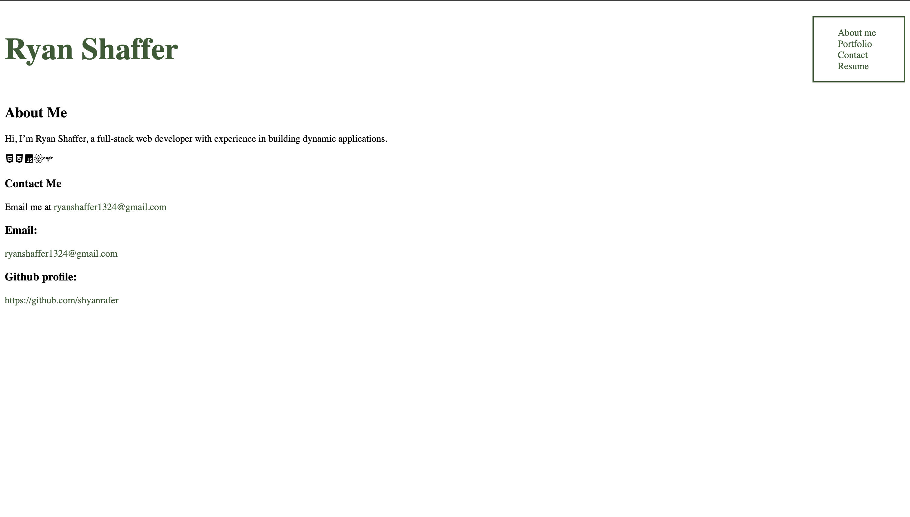
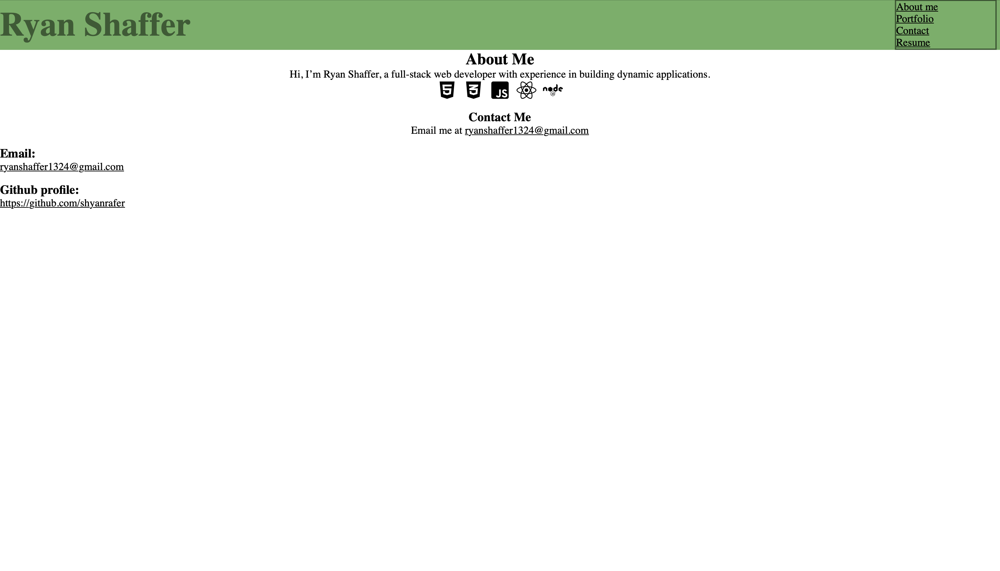

# React portfolio

## Table of Contents
- [Description](#description)
- [Challenges](#challenges)
- [Credit](#credit)
- [Contact](#contact)

## Description
This project is both to showcase my projects overall but also my capacity to utilize React. The goal is to build a sleek, attractive, but also functional and clean portfolio.  

## Challenges
This project was a great learning opportunity for me. It had been a while in my class that an assignment really stumped me but this one did. I couldn't for the life of me figure out how to get anything to render. To overcome this, I went back to basic things like 'do I have my files imported correctly?' I also referenced previous assignments and went over things line by line. The error message I kept receiving had to do with file imports so through referencing I eventually was able to properly import and export files. Once I got *something* to render I knew it was game on. Styling is still a weaker subject for me, so I will be taking time to style this page out, along with really completing the page. Lots more to add to make it a finished work.
<br/><br/>
As is, my page runs when i run npm start but doesnt seem to render when I check it out via GitHub pages. That is the next challenge I shall tackle. (9/22/24)

## Credit 
This template, from running 'create vite' provides a minimal setup to get React working in Vite with HMR and some ESLint rules.
<br/>
Currently, two official plugins are available:
<br/>
- [@vitejs/plugin-react](https://github.com/vitejs/vite-plugin-react/blob/main/packages/plugin-react/README.md) uses [Babel](https://babeljs.io/) for Fast Refresh
- [@vitejs/plugin-react-swc](https://github.com/vitejs/vite-plugin-react-swc) uses [SWC](https://swc.rs/) for Fast Refresh
<br/><br/>
- https://www.color-hex.com/color-palette/29406 - for #3f5a36 in header

## Contact
Preferred method of contact is email
<br/>
Email: ```ryanshaffer1324@gmail.com```
<br/>
Github profile: https://github.com/shyanrafer
<br/>
Project repo link: https://github.com/shyanrafer/react-portfolio

## Screenshots

(9/19/2024)

(9/22/2024)
 

